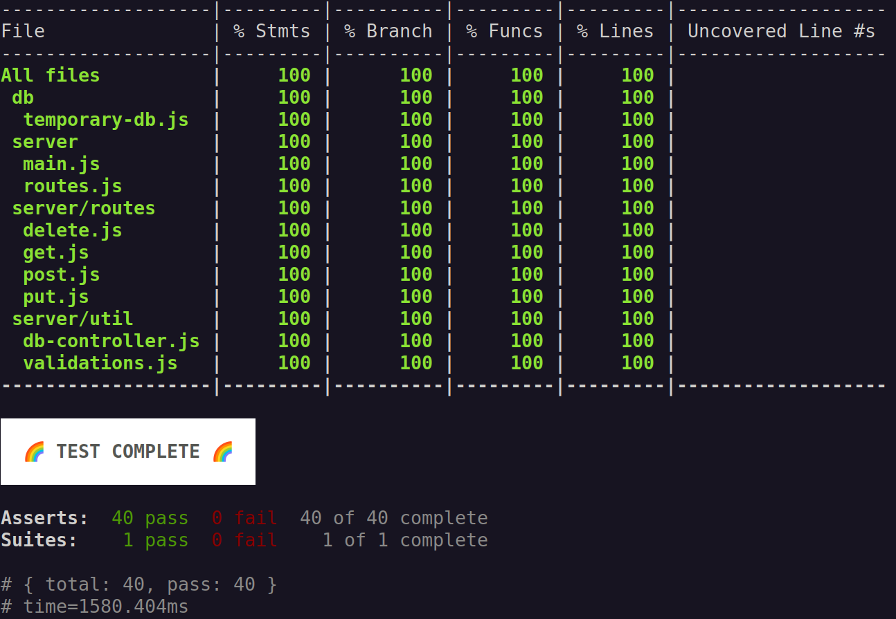

# Projeto de estudos: CRUD com NodeJS

[](https://opensource.org/licenses/MPL-2.0)

Estudo do desenvolvimento e testagem de uma API simples para criação de `tasks` em um JSON.

Projeto inspirado no [Desafio-01-Node](https://github.com/constHugoLinhares/Desafio-01-Node) apresentado por @constHugoLinhares.

## Objetivo

>**Desenvolvolver uma API simples, no modelo CRUD, capaz dos seguintes comandos:**
- `POST` - Adicionar novas tasks
- `GET` - Consultar todas as tasks existentes
- `PUT` - Modificar uma task com base no ID dela
- `DELETE` - Apagar por completo uma task
- `/` - Listar todas as rotas criadas

**Cada task possui a seguinte estrutura**:
```json
{
    "id"           : "id_123456-1122334455667",
    "title"        : "Anything (with <=60 chars)",
    "description"  : "Anything (with <=300 chars)",
    "created_at"   : 1122334455667,
    "updated_at"   : 1122334455667,
    "completed_at" : null | 1122334455667
}
```


## Ferramentas utilizadas
|Ferramenta|Finalidade|
|-:|:-|
| |Versionamento e demarcação das etapas do projeto|
||Construção de funções e validações necessárias|
||Inicialização e testagem do projeto|

## Rotas construídas

<details>
<summary><strong>/task - POST - (Criar nova rota)</strong></summary>

**Dados esperados**
```json
{
    "title"       : "string",
    "description" : "string"
}
```

**Resultado esperado**
```json
{
    "result"  : "Task created",
    "task_id" : "id_123456-1122334455667"
}
```
---

</details>

<details>
<summary><strong>/task - GET - (Consultar todas as tasks)</strong></summary>

**Dados esperados**
```json
"headers": {
    "authorizaton": "token (currently anything non-null)"
}
```

**Resultado esperado**
```json
{
    "result" : "Authorized request",
    "data"   : "[{data}]"
}
```
---

</details>

<details>
<summary><strong>/task - PUT - (Alterar uma task pelo ID)</strong></summary>

**Dados esperados**
```json
{
    "id"          : "id_123456-1122334455667",
    "title"       : "string",
    "description" : "string"
}
```

**Resultado esperado**
```json
{
    "result"  : "Task updated",
    "task_id" : "id_123456-1122334455667"
}
```
---

</details>

<details>
<summary><strong>/task - DELETE - (Apagar uma task pelo ID)</strong></summary>

**Dados esperados**
```json
"headers": {
    "authorizaton" : "token (currently anything non-null)"
}

{
    "id" : "id_123456-1122334455667"
}
```

**Resultado esperado**
```json
{
    "result"  : "Task deleted",
    "task_id" : "id_123456-1122334455667"
}
```

</details>

## Sobre testes
Para este projeto foi utilizado o [NodeJS test runner](https://nodejs.org/api/test.html) para construção de testes unitários automatizados, assim como o [Insomnia](https://insomnia.rest/) para testes manuais e observações de comportamento.

**Resultado atual dos testes automatizados:**


Caso tenha interesse em verificar os testes manuais utilizados, utilize o arquivo [INSOMNIA_TEST_SUIT](INSOMNIA_TEST_SUIT.json) junto ao programa [Insomnia](https://insomnia.rest/).

## Como baixar e rodar

0. Instale o [NodeJS](https://nodejs.org/en/download/current) versão >=20.6.0
1. Clone o projeto localmente através do comando: `git clone https://github.com/stallone-dev/node-crud-basic.git`
2. Abra a pasta do projeto em seu terminal: `cd ~/SUA_PASTA_DE_PROJETOS/node-crud-basic/`
3. Inicie o projeto com o comando: `npm start`
   1. Caso queira verificar os testes do projeto, utilize: `npm t`
4. **Desfrute do código à vontade**.
